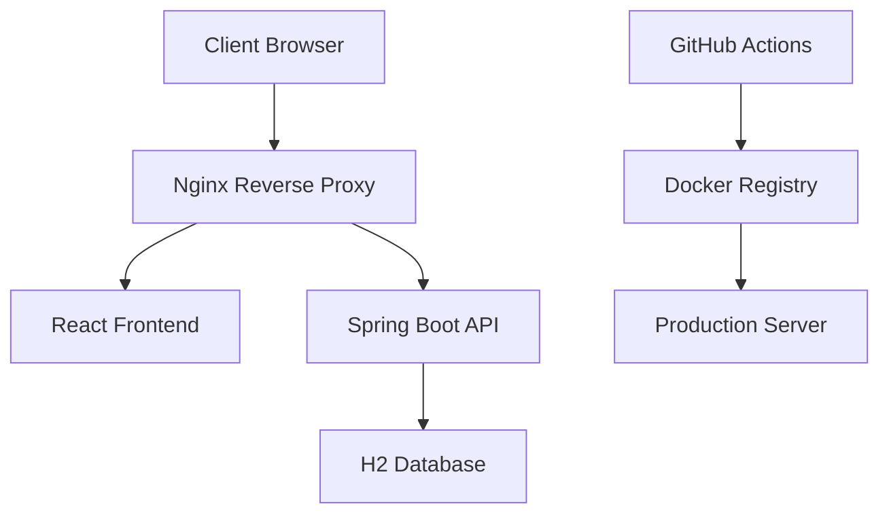

# 🚀 GotoDrop - Application Full-Stack

Une application web moderne développée avec Spring Boot (Backend) et React/Vite (Frontend), entièrement conteneurisée avec Docker et déployée via GitHub Actions.

## 📋 Table des matières

- [🏗️ Architecture](#️-architecture)
- [📁 Structure du projet](#-structure-du-projet)
- [🚀 Démarrage rapide](#-démarrage-rapide)
- [🔧 Configuration](#-configuration)
- [🐳 Docker](#-docker)
- [🌍 Déploiement](#-déploiement)
- [📚 API Documentation](#-api-documentation)
- [🧪 Tests](#-tests)
- [🔒 Sécurité](#-sécurité)
- [📊 Monitoring](#-monitoring)

## 🏗️ Architecture



### Stack Technologique

**Backend:**

- ☕ **Java 17** avec **Spring Boot 3.2**
- 🗄️ **Spring Data JPA** pour la persistance
- 🗃️ **H2 Database** (en mémoire pour dev, fichier pour prod)
- 🔒 **Spring Security** (optionnel)
- 📊 **Spring Actuator** pour le monitoring

**Frontend:**

- ⚛️ **React 18** avec **TypeScript**
- ⚡ **Vite** pour le build et le développement
- 🎨 **CSS3** moderne
- 🌐 **Nginx** pour servir les fichiers statiques

**DevOps:**

- 🐳 **Docker** et **Docker Compose**
- 🔄 **GitHub Actions** pour CI/CD
- 📦 **GitHub Container Registry** (GHCR)
- 🏥 **Health Checks** automatiques

## 📁 Structure du projet

```
GotoDrop/
├── 📁 Backend/                     # API Spring Boot
│   ├── 📁 src/main/java/com/example/api/
│   │   ├── 📁 controller/          # Contrôleurs REST
│   │   ├── 📁 entity/              # Entités JPA
│   │   ├── 📁 repository/          # Repositories
│   │   ├── 📁 service/             # Services métier
│   │   ├── 📁 config/              # Configuration
│   │   └── 📄 GotoDropApiApplication.java
│   ├── 📁 src/main/resources/
│   │   ├── 📄 application.properties
│   │   └── 📄 application-docker.properties
│   ├── 📄 Dockerfile
│   ├── 📄 pom.xml
│   └── 📄 .dockerignore
├── 📁 Frontend/                    # Interface React
│   ├── 📁 src/
│   │   ├── 📄 App.tsx
│   │   ├── 📄 main.tsx
│   │   └── 📁 assets/
│   ├── 📁 public/
│   ├── 📄 Dockerfile
│   ├── 📄 nginx.conf
│   ├── 📄 package.json
│   ├── 📄 vite.config.ts
│   └── 📄 .dockerignore
├── 📁 .github/workflows/           # GitHub Actions
│   ├── 📄 deploy.yml               # Déploiement principal
│   ├── 📄 tests.yml                # Tests automatiques
│   ├── 📄 release.yml              # Gestion des releases
│   └── 📄 cleanup.yml              # Nettoyage automatique
├── 📁 scripts/                     # Scripts utilitaires
│   ├── 📄 deploy-remote.sh         # Déploiement serveur distant
│   ├── 📄 load-env.sh              # Chargement variables (Linux)
│   └── 📄 load-env.ps1             # Chargement variables (Windows)
├── 📄 docker-compose.yml           # Développement
├── 📄 docker-compose.prod.yml      # Production
├── 📄 deploy.ps1                   # Script déploiement Windows
├── 📄 deploy.sh                    # Script déploiement Linux
├── 📄 .env.example                 # Template variables
├── 📄 .gitignore
└── 📄 README.md
```

## 🚀 Démarrage rapide

### Prérequis

- 🐳 **Docker Desktop** installé et en cours d'exécution
- 📦 **Git** pour cloner le repository
- 🖥️ **PowerShell** (Windows) ou **Bash** (Linux/Mac)

### Installation

1. **Cloner le repository**

```bash
git clone https://github.com/your-username/gotodrop.git
cd gotodrop
```

2. **Configurer les variables d'environnement**

```bash
# Copier le fichier d'exemple
cp .env.example .env

# Éditer .env avec vos valeurs
# Notamment : REGISTRY_USERNAME et GITHUB_REPOSITORY
```

3. **Démarrer l'application**

**Windows (PowerShell):**

```powershell
.\deploy.ps1
```

**Linux/Mac (Bash):**

```bash
chmod +x deploy.sh
./deploy.sh
```

4. **Accéder à l'application**

- 🌐 **Frontend**: http://localhost:3000
- 🔧 **API**: http://localhost:8080/api
- 🗄️ **H2 Console**: http://localhost:8080/h2-console
- 📊 **Health Check**: http://localhost:8080/actuator/health

## 🔧 Configuration

### Variables d'environnement

Le projet utilise des fichiers `.env` pour la configuration :

| Fichier        | Usage         | Description           |
| -------------- | ------------- | --------------------- |
| `.env`         | Développement | Configuration locale  |
| `.env.prod`    | Production    | Configuration serveur |
| `.env.example` | Documentation | Template à copier     |

### Variables principales

```bash
# Images Docker
BACKEND_IMAGE=ghcr.io/your-username/gotodrop/back
FRONTEND_IMAGE=ghcr.io/your-username/gotodrop/front

# Ports
BACKEND_PORT=8080
FRONTEND_PORT=3000

# URLs
API_URL=http://localhost:8080/api
FRONTEND_URL=http://localhost:3000

# Base de données
DB_NAME=gotodrop
DB_USERNAME=sa
DB_PASSWORD=
```

### Configuration H2 Console

- **JDBC URL**: `jdbc:h2:file:/app/data/testdb`
- **Username**: `sa`
- **Password**: (vide)

## 🐳 Docker

### Développement

```bash
# Démarrer tous les services
docker-compose up -d

# Voir les logs
docker-compose logs -f

# Redémarrer un service
docker-compose restart backend

# Arrêter tous les services
docker-compose down
```

### Production

```bash
# Charger la config production
source scripts/load-env.sh production

# Démarrer en production
docker-compose -f docker-compose.prod.yml up -d
```

### Images Docker

Les images sont automatiquement construites et publiées sur GitHub Container Registry :

- **Backend**: `ghcr.io/your-username/gotodrop/back:latest`
- **Frontend**: `ghcr.io/your-username/gotodrop/front:latest`

## 🌍 Déploiement

### 1. Déploiement local

Le plus simple pour tester localement :

```powershell
# Windows
.\deploy.ps1

# Linux/Mac
./deploy.sh
```

### 2. Déploiement via GitHub Actions

Le projet inclut des workflows GitHub Actions pour l'automatisation :

#### Configuration requise

1. **Secrets GitHub** (Settings > Secrets and variables > Actions) :

```
SSH_PRIVATE_KEY    # Clé SSH pour le serveur distant
SONAR_TOKEN       # Token SonarCloud (optionnel)
```

2. **Variables d'environnement** :

```
API_URL           # URL de l'API en production
DB_PASSWORD       # Mot de passe DB production
```

#### Déclenchement automatique

- ✅ **Push sur main** → Tests + Build + Déploiement
- ✅ **Pull Request** → Tests seulement
- ✅ **Tag v\*.\*** → Release + Déploiement production

### 3. Déploiement sur serveur distant

#### Option A : Serveur VPS/Cloud

1. **Préparer le serveur**

```bash
# Installer Docker
curl -fsSL https://get.docker.com -o get-docker.sh
sh get-docker.sh

# Installer Docker Compose
sudo curl -L "https://github.com/docker/compose/releases/download/v2.21.0/docker-compose-$(uname -s)-$(uname -m)" -o /usr/local/bin/docker-compose
sudo chmod +x /usr/local/bin/docker-compose
```

2. **Configurer l'accès SSH**

```bash
# Générer une clé SSH
ssh-keygen -t ed25519 -C "github-actions"

# Ajouter la clé publique au serveur
ssh-copy-id user@your-server.com
```

3. **Configurer le déploiement**

```bash
# Sur le serveur, créer le répertoire
sudo mkdir -p /opt/gotodrop
sudo chown $USER:$USER /opt/gotodrop

# Copier les fichiers de configuration
scp docker-compose.prod.yml user@your-server:/opt/gotodrop/
scp .env.prod user@your-server:/opt/gotodrop/.env
```

4. **Déployer**

```bash
# Via GitHub Actions (automatique sur push)
git tag v1.0.0
git push origin v1.0.0

# Ou manuellement
ssh user@your-server
cd /opt/gotodrop
docker-compose pull
docker-compose up -d
```

#### Option B : Services cloud managés

**AWS ECS:**

```bash
# Utiliser les images GHCR dans vos task definitions
# Backend: ghcr.io/your-username/gotodrop/back:latest
# Frontend: ghcr.io/your-username/gotodrop/front:latest
```

**Google Cloud Run:**

```bash
# Déployer directement depuis GHCR
gcloud run deploy gotodrop-back \
  --image ghcr.io/your-username/gotodrop/back:latest \
  --platform managed \
  --region europe-west1

gcloud run deploy gotodrop-front \
  --image ghcr.io/your-username/gotodrop/front:latest \
  --platform managed \
  --region europe-west1
```

**Azure Container Instances:**

```bash
az container create \
  --resource-group myResourceGroup \
  --name gotodrop-back \
  --image ghcr.io/your-username/gotodrop/back:latest \
  --ports 8080
```

### 4. Configuration Nginx (optionnelle)

Pour un déploiement avec domaine personnalisé :

```nginx
server {
    listen 80;
    server_name gotodrop.example.com;

    location / {
        proxy_pass http://localhost:3000;
        proxy_set_header Host $host;
        proxy_set_header X-Real-IP $remote_addr;
    }

    location /api {
        proxy_pass http://localhost:8080;
        proxy_set_header Host $host;
        proxy_set_header X-Real-IP $remote_addr;
    }
}
```

### 5. SSL/HTTPS avec Let's Encrypt

```bash
# Installer Certbot
sudo apt install certbot python3-certbot-nginx

# Obtenir un certificat
sudo certbot --nginx -d gotodrop.example.com

# Renouvellement automatique
sudo crontab -e
# Ajouter : 0 12 * * * /usr/bin/certbot renew --quiet
```

## 📚 API Documentation

### Endpoints disponibles

| Méthode | Endpoint                         | Description                   |
| ------- | -------------------------------- | ----------------------------- |
| GET     | `/api/users`                     | Liste tous les utilisateurs   |
| GET     | `/api/users/{id}`                | Obtenir un utilisateur par ID |
| POST    | `/api/users`                     | Créer un nouvel utilisateur   |
| PUT     | `/api/users/{id}`                | Mettre à jour un utilisateur  |
| DELETE  | `/api/users/{id}`                | Supprimer un utilisateur      |
| GET     | `/api/users/search?keyword=...`  | Rechercher des utilisateurs   |
| GET     | `/api/users/username/{username}` | Obtenir par nom d'utilisateur |

### Exemples d'utilisation

**Créer un utilisateur:**

```bash
curl -X POST http://localhost:8080/api/users \
  -H "Content-Type: application/json" \
  -d '{
    "username": "johndoe",
    "email": "john@example.com",
    "password": "password123"
  }'
```

**Obtenir tous les utilisateurs:**

```bash
curl http://localhost:8080/api/users
```

**Rechercher des utilisateurs:**

```bash
curl "http://localhost:8080/api/users/search?keyword=john"
```

### Monitoring

- **Health Check**: `GET /actuator/health`
- **Metrics**: `GET /actuator/metrics`
- **Info**: `GET /actuator/info`

## 🧪 Tests

### Tests automatiques

Les tests sont exécutés automatiquement via GitHub Actions :

```bash
# Backend (Maven)
cd Backend
mvn test

# Frontend (npm)
cd Frontend
npm test
```

### Tests locaux

```bash
# Tester l'API
curl -f http://localhost:8080/actuator/health

# Tester le frontend
curl -f http://localhost:3000
```

## 🔒 Sécurité

### Bonnes pratiques implémentées

- ✅ **Images Docker minimales** (Alpine Linux)
- ✅ **Utilisateur non-root** dans les conteneurs
- ✅ **Variables d'environnement** pour les secrets
- ✅ **CORS configuré** pour les domaines autorisés
- ✅ **Health checks** automatiques
- ✅ **Analyse de sécurité** avec Trivy

### Configuration CORS

```java
// Dans CorsConfig.java
.allowedOrigins("https://gotodrop.com", "https://www.gotodrop.com")
.allowedMethods("GET", "POST", "PUT", "DELETE", "OPTIONS")
```

## 📊 Monitoring

### Métriques disponibles

- **Application**: Spring Boot Actuator
- **Conteneurs**: Docker stats
- **Logs**: Centralisés dans `./logs/`

### Commandes utiles

```bash
# Voir les métriques en temps réel
docker stats

# Suivre les logs
docker-compose logs -f

# Vérifier l'état des services
docker-compose ps
```

---

## 🛠️ Dépannage

### Problèmes courants

**Port déjà utilisé:**

```bash
# Vérifier les ports
netstat -tulpn | grep :8080
# Arrêter les services
docker-compose down
```

**Images non trouvées:**

```bash
# Construire les images localement
docker-compose build --no-cache
```

**Problème de permissions:**

```bash
# Linux/Mac
sudo chown -R $USER:$USER .
```

### Logs de débogage

```bash
# Logs détaillés du backend
docker-compose logs backend

# Logs en temps réel
docker-compose logs -f --tail=100
```

## 🤝 Contribution

1. Fork le projet
2. Créer une branche feature (`git checkout -b feature/amazing-feature`)
3. Commit les changements (`git commit -m 'Add amazing feature'`)
4. Push vers la branche (`git push origin feature/amazing-feature`)
5. Ouvrir une Pull Request

## 📝 Licence

Ce projet est sous licence MIT. Voir le fichier `LICENSE` pour plus de détails.

## 📞 Support

- 📧 **Email**: support@gotodrop.com
- 🐛 **Issues**: [GitHub Issues](https://github.com/your-username/gotodrop/issues)
- 📖 **Documentation**: [Wiki](https://github.com/your-username/gotodrop/wiki)

---

**Développé avec ❤️ par l'équipe GotoDrop**
